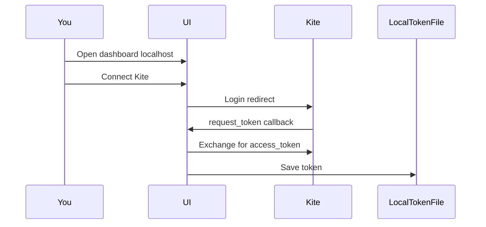
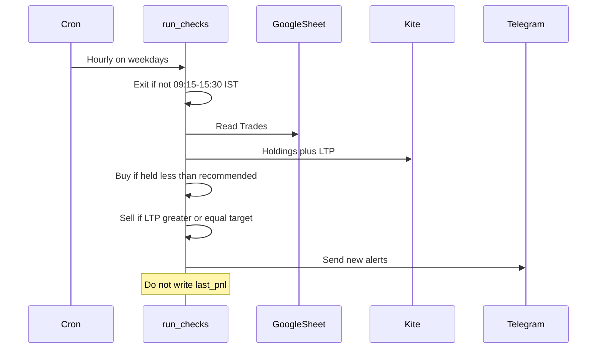
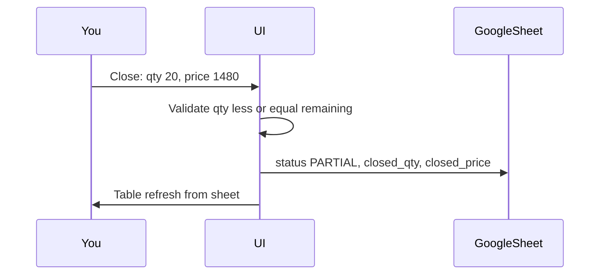

# 2. Features, business rules, and flows

This document is the functional spec. Implementation should match these rules even if older code still uses buy-range / stop-loss / MySQL.

## 2.1 Core features

### F1 — Read planned trades from Google Sheets

- One **Trades** tab: one row = one trade idea.
- One **Config** tab (or a named range): `total_budget`, `risk_percentage`, and optional notes.
- The app never treats MySQL as the source of planned trades. Every dashboard load and every cron run **pulls the sheet**.
- Headers are configurable (`SHEET_COLUMN_MAP`) so you can keep your existing column names.

### F2 — Compare to Zerodha portfolio

- Kite `holdings()` is the **source of truth for held quantity**. The dashboard and buy-gap alerts use that number. If the sheet `Quantity` / current qty cell differs, the app **writes Kite’s qty back to the sheet**. A symbol on the sheet but not in Kite holdings is treated as held **0**. Sheet sync does not overwrite a qty that already came from Zerodha.
- Kite `ltp()` (or last price on the holding) supplies current price for symbols that appear on the sheet.
- Match key: `EXCHANGE:SYMBOL` (default exchange `NSE`).
- If Kite is disconnected (expired daily token), the UI still shows sheet data; hourly alerts skip or send a single “Kite session expired” Telegram message.

### F3 — Buy alerts (Telegram)

**Trigger (hourly cron, market hours only):** for each **open / partial** row:

```
held_qty < recommended_qty
```

**Action:** notify to **buy the difference**:

```
buy_qty = recommended_qty - held_qty
```

**Price context in the message:** current LTP vs **recommended price** on the sheet, for example:

- LTP ≤ recommended price → “in plan / at or below recommended buy”
- LTP > recommended price → still alert the gap (you are underweight) but label it “above recommended price”

Do **not** require a buy-range band (`buy_low`–`buy_high`) in the target product. Recommended price is the single buy reference.

**Dedupe:** at most one buy alert per symbol per calendar day (IST), unless held qty or recommended qty changed enough to warrant a new message (optional later). First version: one buy alert per symbol per IST day.

### F4 — Sell alerts (Telegram)

**Trigger (same market-hours cron as buy):** for each row that still has held quantity `> 0`:

```
ltp >= target
```

**Action:** notify to **sell** (held quantity, or remaining planned quantity — message should include both held qty and target).

Stop-loss alerts are **out of scope** for this blueprint unless you add a `stop_loss` column later as an extra sell rule (`ltp <= stop_loss`).

**Dedupe:** one sell-target alert per symbol per IST day.

### F5 — Cron on this machine (weekdays, trading session only)

NSE/BSE **equity cash** session:

| Rule | Value |
| --- | --- |
| Days | Monday–Friday only (not Saturday/Sunday) |
| Open | 09:15 IST |
| Close | 15:30 IST |
| Timezone | `Asia/Kolkata` |
| Cadence inside the window | About once per hour |

**Must not send buy/sell Telegram alerts** when:

- It is a weekend
- Local IST time is before 09:15 or after 15:30
- (Optional later) the day is an exchange holiday — first version may still run on holidays; skip if you add a holiday calendar

How to enforce (both are required in spirit; implement at least the app-side guard):

1. **App:** `run_checks` calls `within_market_hours()` first. If false, **exit 0 with a log line** — no Kite spam, no Telegram, no P/L writes.
2. **OS:** crontab limited to the session so the process barely runs overnight, e.g. `0 10-15 * * 1-5` (10:00–15:00 IST clock hours) **plus** the in-process 09:15 / 15:30 check so a 15:00 run still stops at 15:30 and a 9:00 run does nothing.

`launchd`/`cron` still invokes `uv run python manage.py run_checks`. That command: **if market open** → read sheet → Kite holdings/LTP → buy/sell → Telegram. It must **not** compute or persist dashboard P/L.

### F6 — Dashboard (no authentication)

Open `http://127.0.0.1:8000/` with no login.

**Always visible (from sheet + last Kite fetch in that request):**

- Table of trades: symbol, recommended qty, held qty, difference, recommended price, LTP, target, status
- Panel: **total budget**, **risk percentage** (from Config tab)
- Colour: closed in profit = green, closed in loss = red, open = neutral

**Manual only:**

- Button **Calculate P/L** — on click, fetch sheet + holdings/LTP (or use prices from this same request), compute:

  - realized P/L from closed qty/price on the sheet (and any close rows)
  - unrealized P/L from remaining qty × (LTP − avg buy)
  - **net P/L** = realized + unrealized
  - total invested (open remaining × avg buy)

  Show the timestamp of the last manual calculation. Reloading the page without clicking the button must **not** be required to hide old figures, but it must **not** refresh P/L by itself either: store the last calculated snapshot in **memory for that process** or write a “last PnL” pair of cells on the Config sheet. Preferred: **Config sheet cells** `last_pnl`, `last_pnl_at` so a restart still shows the last manual result. Hourly cron must not update those cells.

### F7 — Close trade (UI → sheet)

- Button per open/partial row.
- Inputs: quantity (default remaining; allow partial) and close price.
- Updates the Google Sheet row: `status` (`PARTIAL` / `CLOSED`), `closed_qty`, `closed_price`, and remaining if you keep a remaining/qty column.
- Does not place a Kite order.

### F8 — Connect Kite (daily token)

- Kite access tokens expire daily.
- Dashboard control to start Kite login and land on `/kite/callback/` with `request_token`.
- Token may be stored in a **local file** (e.g. `.kite-session.json`, gitignored) because there is no DB. Not in Google Sheets.

### F9 — Tradebook ingest (occasional script)

Paste Zerodha tradebook exports into tabs named **`Tradebook - …`** (any suffix). Run:

```bash
./scripts/ingest-tradebook.sh
```

The script:

1. Reads those tabs (and the previous **`Tradebook - Ledger`** so older periods are not lost).
2. Keeps only what it needs for next time in **`Tradebook - Ledger`**, plus a **`Tradebook - Matched`** summary for dashboard symbols.
3. Attaches fills to each tracked share’s detail page.
4. If it sees **BUY then later SELL** and Zerodha held qty is **0**, marks the trade **CLOSED** and writes realized P/L (FIFO). A leftover holding after sells is **PARTIAL**.

Dashboard list: filter by position (OPEN / PARTIAL / CLOSED) and arrange by name or position. Closed rows are green on profit and red on loss.

## 2.2 Sheet contract (business data)

### Tab: `Trades`

| Column | Required | Role |
| --- | --- | --- |
| `symbol` | yes | Trading symbol, e.g. `INFY` |
| `exchange` | no | Default `NSE` |
| `recommended_qty` | yes | Planned holding |
| `recommended_price` | yes | Plan entry / buy reference |
| `target` | yes | Sell if LTP ≥ this |
| `quantity` | no | Optional manual “I think I hold X”; **Kite holdings override** when Kite is connected |
| `status` | no | `OPEN` / `PARTIAL` / `CLOSED`; default `OPEN` |
| `closed_qty` | app-written | Cumulative closed from the UI |
| `closed_price` | app-written | Last close price from the UI |
| `notes` | no | Free text |

Map `qty` → `recommended_qty` via `SHEET_COLUMN_MAP` if your sheet still says `qty`.

### Tab: `Config`

| Key | Example | Shown on dashboard |
| --- | --- | --- |
| `total_budget` | `500000` | Total budget |
| `risk_percentage` | `2` | Risk % |
| `last_pnl` | written by **Calculate P/L** only | Net P/L so far |
| `last_pnl_at` | ISO timestamp | When you last calculated |

Risk display: `risk_amount = total_budget * (risk_percentage / 100)` (e.g. ₹10,000 at 2% of ₹5,00,000). That is a **limit label**, not an order check.

## 2.3 Business rules (precise)

**Avg buy for P/L**

1. If Kite holding exists → `average_price` from Kite.
2. Else → `recommended_price` from the sheet.
3. Else → 0 (skip that row’s P/L).

**Realized P/L** (on manual calculate and after close, for display)

```
(closed_price - avg_buy) * closed_qty
```

If multiple partials exist only as a single `closed_price` on the sheet, use last close price × total closed qty (limitation). Better later: a `Closes` tab with one row per close event.

**Unrealized P/L**

```
(ltp - avg_buy) * held_qty
```

Use Kite `held_qty` when available, else sheet `quantity`.

**Closed colour**

- `status == CLOSED` and realized P/L ≥ 0 → profit (green)
- `status == CLOSED` and realized P/L < 0 → loss (red)

**Cron vs button**

| Job | Buy/sell Telegram | Update LTP on UI | Write `last_pnl` |
| --- | --- | --- | --- |
| Hourly `run_checks` (only if market is open) | yes | no requirement | **never** |
| Page load | no | optional live fetch for the table | **never** |
| Calculate P/L | no | yes, as part of the calc | **yes** |

## 2.4 End-to-end flows

### Flow A — Morning: connect Kite, then let cron work



Then during the trading session, about once an hour:



### Flow B — Buy gap

1. Sheet: INFY recommended 50 @ 1450, target 1700, status OPEN.
2. Kite: hold 10, LTP 1440.
3. Cron: `10 < 50` → Telegram: buy **40** INFY; LTP 1440 is at/below recommended 1450.
4. You buy in Kite. Next hour held is 50 → no buy alert.

### Flow C — Sell at target

1. Same row, held 50, LTP 1710, target 1700.
2. Cron: `1710 >= 1700` → Telegram: sell INFY (held 50) at/above target.
3. You sell in Kite, then close the idea in the UI (or mark CLOSED on the sheet).

### Flow D — Close from UI



### Flow E — Manual P/L only

1. Dashboard shows budget, risk %, last saved P/L (possibly stale).
2. You click **Calculate P/L**.
3. App reads sheet + Kite, computes net P/L, writes `last_pnl` / `last_pnl_at` on Config, re-renders.
4. Hourly cron runs later: Telegram may fire; **those Config P/L cells stay unchanged**.

### Flow F — Underweight but expensive

1. Held 10, recommended 50, LTP 1600, recommended price 1450.
2. Still a **buy 40** alert (gap vs plan), with copy that LTP is **above** recommended price so you can ignore or wait.

## 2.5 Out of scope (unless listed later in Progress)

- Placing/modifying/cancelling Kite orders
- Options, F&O, basket orders
- Multi-user or remote access without SSH tunnel
- Stop-loss Telegram (current blueprint: target-only sell)
- Recalculating P/L on a timer
- Alerts on weekends or outside 09:15–15:30 IST
