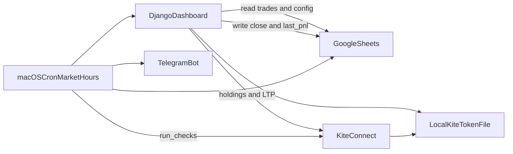

# 3. Technical architecture

## 3.1 Target shape

Sheet-first, local process, no trade DB.



Django remains the app framework so views, templates, and `manage.py run_checks` stay in one place. Persistence for **trades** is the spreadsheet. Persistence for the **Kite session** is a gitignored local file.

## 3.2 Stack

| Layer | Choice | Notes |
| --- | --- | --- |
| Language | Python 3.12 | Pinned via UV (`.python-version`) |
| Env | UV | `pyproject.toml` / `uv.lock` |
| Web | Django 5 | Templates + Bootstrap CDN |
| Sheet | `gspread` + service account | Read all values; batch update close/P&L cells |
| Broker | `kiteconnect` | Placeholders: `KITE_API_KEY`, `KITE_API_SECRET`, `KITE_API_BASE_URL` |
| Alerts | Telegram Bot API | `sendMessage` |
| Scheduler | macOS cron or `launchd` | Invoke `run_checks` about hourly **Mon–Fri in the cash session**; the command no-ops outside 09:15–15:30 IST |
| Tests | pytest + pytest-django | Mock Sheet, Kite, Telegram |

**Removed from the blueprint:** MySQL, Docker Compose as a required runtime, Django `User` login, APScheduler 5-minute market-hours loop as the primary scheduler, GitHub Actions as the primary poller.

SQLite/MySQL may remain in the repo until the refactor in [Progress](04-progress.md) lands; they must not be required to use the product.

## 3.3 Repository layout (current code)

```
trade-tally/
  config/                 # Django settings, URLs
  trades/                 # Dashboard, close form, models (legacy DB)
  integrations/           # Kite, Sheets, Telegram, checker, run_checks
  templates/              # Dashboard and (legacy) login
  tests/                  # Parser, alerts, close, P/L, webhook
  docs/                   # This blueprint
  manage.py
  pyproject.toml
  .env.example
```

### Suggested target modules (after aligning to this blueprint)

| Module | Responsibility |
| --- | --- |
| `integrations/sheets.py` | Parse Trades + Config; write close; write last P/L |
| `integrations/kite.py` | Login URL, token exchange, holdings, LTP; load/save token file |
| `integrations/telegram.py` | Send buy/sell (and optional “token expired”) |
| `integrations/checker.py` | Pure functions: buy gap, sell at target, message text, dedupe file |
| `integrations/management/commands/run_checks.py` | Hourly entry: sheet + kite + alerts only |
| `trades/views.py` | Unauthenticated dashboard, close, calculate P/L, Kite callback |
| `trades/services.py` | P/L math used **only** by the calculate button and display of stored last_pnl |
| `integrations/alerts_state.py` | Optional gitignored `.alert-log.json` for daily dedupe (replaces `AlertLog` model) |

Dedupe without a DB: a JSON file `{ "INFY:BUY:2026-08-31": true }` or a hidden “Alerts” tab. Prefer a **local JSON file** so the hourly job does not write the trading sheet except for closes/P&L.

## 3.4 Request and job paths

### Dashboard GET `/`

1. Load Config + Trades from Google Sheets.
2. If Kite token file exists, fetch holdings + LTP and join onto rows.
3. Render table + budget + risk %.
4. Show `last_pnl` from Config **as stored**, do not recompute.

### POST `/pnl/calculate/` (Calculate P/L)

1. Same reads as GET.
2. Compute realized, unrealized, net, invested.
3. Write `last_pnl` and `last_pnl_at` to Config.
4. Redirect to dashboard.

### POST `/trades/close/` (identify row by sheet_row + symbol)

1. Validate qty and price.
2. `batch_update` the Trades row.
3. Redirect. Do not update `last_pnl` unless you also click Calculate P/L.

### `run_checks` (cron)

1. If not weekday 09:15–15:30 IST → log and exit (no Kite, no Telegram, no P/L).
2. Read Trades (not Config P/L write).
3. Holdings + LTP.
4. Evaluate F3/F4; Telegram; update local alert dedupe file.
5. Exit.

### Kite `/kite/login/` and `/kite/callback/`

Unchanged idea from current code; persist session to disk instead of `KiteSession` model.

## 3.5 Buy/sell evaluation (reference implementation)

```text
if not within_market_hours(now_ist):  # Mon-Fri, 09:15-15:30 Asia/Kolkata
    return

buy_qty = recommended_qty - held_qty
if status != CLOSED and buy_qty > 0:
    emit BUY(symbol, buy_qty, ltp, recommended_price)

if status != CLOSED and held_qty > 0 and ltp >= target:
    emit SELL(symbol, held_qty, ltp, target)
```

`held_qty` comes from Kite. If Kite fails, skip alerts (do not guess from a stale DB).

## 3.6 Security (local, no auth)

- Bind `runserver` / gunicorn to `127.0.0.1` only.
- `.env`, `google-credentials.json`, `.kite-session.json` gitignored.
- Service account: Editor on **one** spreadsheet.
- CSRF still on POST (close, calculate P/L). No login cookies.

Anyone with local browser access sees holdings and P/L. That is accepted for a single-user Mac app.

## 3.7 Kite daily token

Kite Connect `access_token` lasts until ~6:00 AM IST the next day. A session-hours cron after expiry will fail until you click **Connect Kite** again (typically each morning before or just after 09:15). Optional: Telegram “Kite login required” once per day when holdings fetch returns 403. Night and weekend cron ticks should not hit Kite at all because of the market-hours guard.

## 3.8 Current vs target architecture

The first scaffold used MySQL models (`TradeIdea`, `CloseEvent`, `AlertLog`, `KiteSession`), Django auth, buy **range** + stop-loss, 5-minute APScheduler, and optional GitHub webhook. That is documented as **legacy** in [Progress](04-progress.md). New work should follow **this** chapter, not the old models.

## 3.9 Testing strategy

Keep tests that do not need live APIs:

- Sheet parser (headers, recommended qty/price, target, config keys)
- Buy: difference qty; no alert when held ≥ recommended
- Sell: LTP ≥ target and held > 0
- Close writeback payload (status, closed_qty, closed_price)
- P/L helpers: realized / unrealized / net; **not** called from `run_checks`
- Dedupe: second BUY same IST day is skipped
- Market hours: no alerts on Saturday, or Friday 08:00 / 16:00 IST; alerts allowed Friday 10:00 IST

Pytest can use Django’s test client without a real MySQL: in-memory SQLite is acceptable **only** if models still exist. After the DB is removed, tests become plain functions + a dummy Django request factory.
